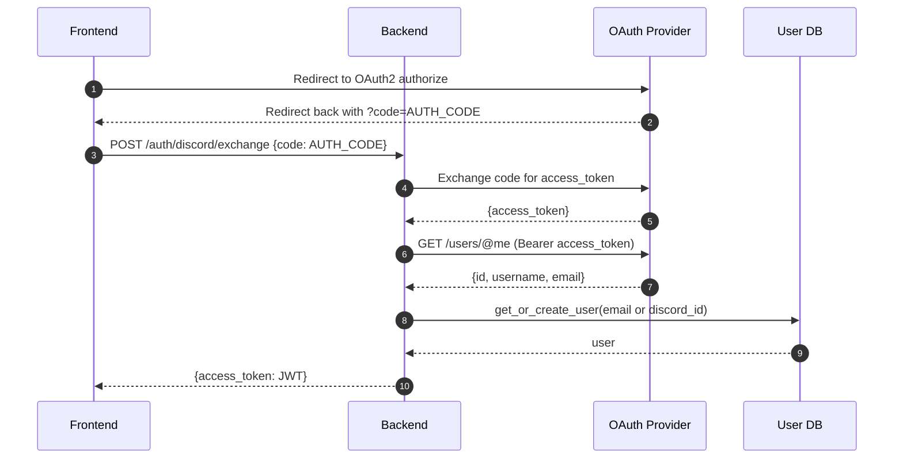

```mermaid
sequenceDiagram
    autonumber

    participant FE as Frontend
    participant BE as Backend
    participant Discord as OAuth Provider
    participant DB as User DB

    FE->>Discord: Redirect to OAuth2 authorize
    Discord-->>FE: Redirect back with ?code=AUTH_CODE
    FE->>BE: POST /auth/discord/exchange {code: AUTH_CODE}
    BE->>Discord: Exchange code for access_token
    Discord-->>BE: {access_token}
    BE->>Discord: GET /users/@me (Bearer access_token)
    Discord-->>BE: {id, username, email}
    BE->>DB: get_or_create_user(email or discord_id)
    DB-->>BE: user
    BE-->>FE: {access_token: JWT}


```