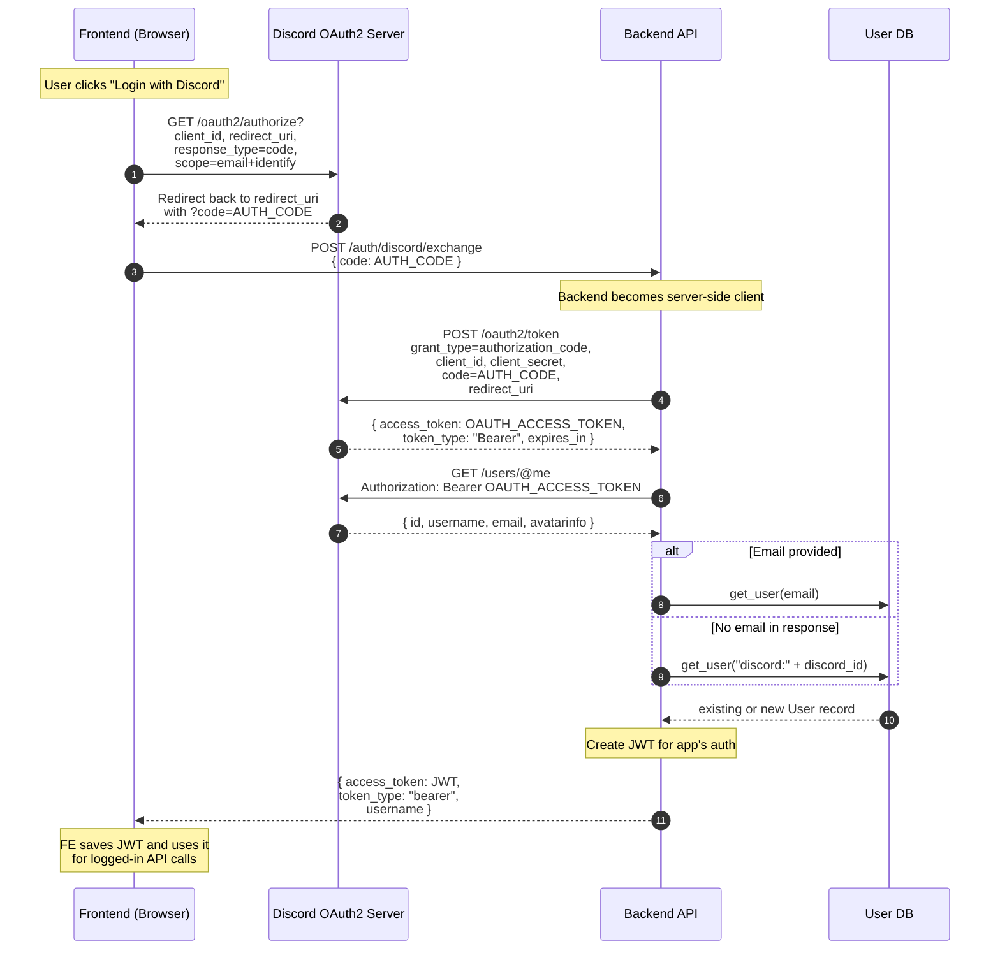

```mermaid
sequenceDiagram
    autonumber

    participant FE as Frontend (Browser)
    participant Discord as Discord OAuth2 Server
    participant BE as Backend API
    participant DB as User DB

    Note over FE: User clicks "Login with Discord"

    FE->>Discord: GET /oauth2/authorize?<br/>client_id, redirect_uri,<br/>response_type=code,<br/>scope=email+identify
    Discord-->>FE: Redirect back to redirect_uri<br/>with ?code=AUTH_CODE

    FE->>BE: POST /auth/discord/exchange<br/>{ code: AUTH_CODE }
    Note over BE: Backend becomes server-side client

    BE->>Discord: POST /oauth2/token<br/>grant_type=authorization_code,<br/>client_id, client_secret,<br/>code=AUTH_CODE,<br/>redirect_uri
    Discord-->>BE: { access_token: OAUTH_ACCESS_TOKEN,<br/>token_type: "Bearer", expires_in }

    BE->>Discord: GET /users/@me<br/>Authorization: Bearer OAUTH_ACCESS_TOKEN
    Discord-->>BE: { id, username, email, avatarinfo }

    alt Email provided
        BE->>DB: get_user(email)
    else No email in response
        BE->>DB: get_user("discord:" + discord_id)
    end

    DB-->>BE: existing or new User record

    Note over BE: Create JWT for app's auth
    BE-->>FE: { access_token: JWT,<br/>token_type: "bearer",<br/>username }

    Note over FE: FE saves JWT and uses it<br/>for logged-in API calls


```