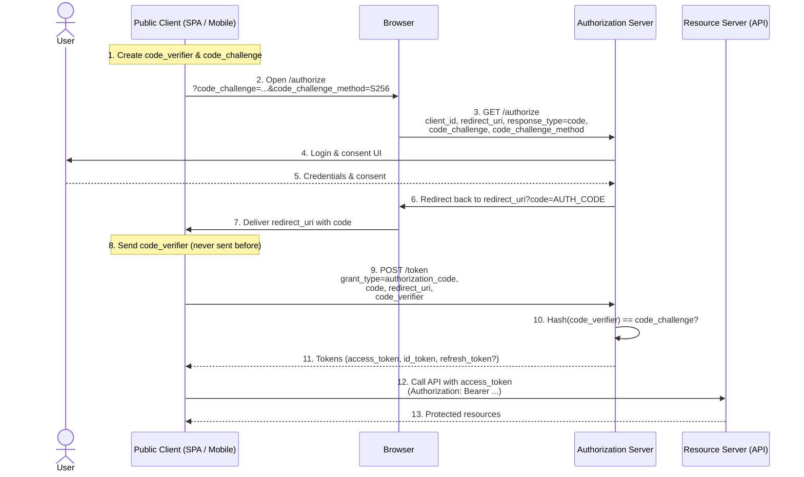

```mermaid
sequenceDiagram
    actor User
    participant PublicClient as Public Client (SPA / Mobile)
    participant Browser
    participant AuthServer as Authorization Server
    participant ResourceServer as Resource Server (API)

    Note over PublicClient: 1. Create code_verifier & code_challenge
    PublicClient->>Browser: 2. Open /authorize<br/>?code_challenge=...&code_challenge_method=S256
    Browser->>AuthServer: 3. GET /authorize<br/>client_id, redirect_uri, response_type=code,<br/>code_challenge, code_challenge_method

    AuthServer->>User: 4. Login & consent UI
    User-->>AuthServer: 5. Credentials & consent

    AuthServer->>Browser: 6. Redirect back to redirect_uri?code=AUTH_CODE
    Browser->>PublicClient: 7. Deliver redirect_uri with code

    Note over PublicClient: 8. Send code_verifier (never sent before)
    PublicClient->>AuthServer: 9. POST /token<br/>grant_type=authorization_code,<br/>code, redirect_uri,<br/>code_verifier

    AuthServer->>AuthServer: 10. Hash(code_verifier) == code_challenge?
    AuthServer-->>PublicClient: 11. Tokens (access_token, id_token, refresh_token?)

    PublicClient->>ResourceServer: 12. Call API with access_token<br/>(Authorization: Bearer ...)
    ResourceServer-->>PublicClient: 13. Protected resources
```